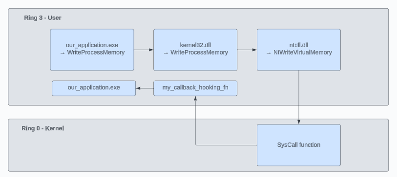

## NTAPI detection based on Nirvana Debugging

### Table Of Content

### Giới thiệu

Trong chủ đề `Process Injection` đã trình bày đến kĩ thuật Nirvana Debugging, kĩ thuật này cho phép đặt 1 Hook ngay phía sau Syscall. Chi tiết bài viết đã được đề cập trước đây: [Nirvana Debugging](https://github.com/vuongle-vigo/WinMalHack-Blog/blob/main/Process%20Injection/Nirvana%20Debugging/Nirvana%20Debugging%20Technique.md). Từ kĩ thuật này, mình có 1 ý tưởng sử dụng kĩ thuật để theo dõi các NTAPI được gọi trong malware.



### Ý tưởng

Việc triển khai yêu cầu phải đặt được Hook trên `Remote Process`, và rất may mắn là `NtSetInformationProcess` hỗ trợ việc này. 

```c
typedef NTSTATUS(WINAPI* NtSetInformationProcessPtr)(
	HANDLE ProcessHandle,
	UINT32 ProcessInformationClass,
	PVOID ProcessInformation,
	ULONG ProcessInformationLength
	);
```

Tuy nhiên trong quá trình triển khai, có 1 vấn đề đặt ra là làm sao để đặt hook đúng tại thời điểm chương trình sẽ chạy các hàm chức năng chính, thay vì các hàm khởi tạo. Vì nếu gọi `NtSetInformationProcess` quá sớm, tại thời điểm chương trình chưa khởi tạo xong, nó sẽ không thành công.

***CreateProcess với CREATE_SUSPENDED hoặc DEBUG_PROCESS***

Ý tưởng là sẽ thực hiện tạo Remote Process với 1 trong 2 tham số ở trên, tuy nhiên, với cách tạo process như vậy thì hàm `NtSetInformationProcess` vẫn không thể thực hiện được, chương trình sẽ bị crash. Nguyên nhân chính là các tiến trình được tạo bằng 2 cách trên hoàn toàn chưa thực hiện các bước khởi tạo môi trường, load các thư viện liên quan.

***Tìm hiểu về quá trình khởi tạo của 1 tiến trình (Windows Process Loader)***
