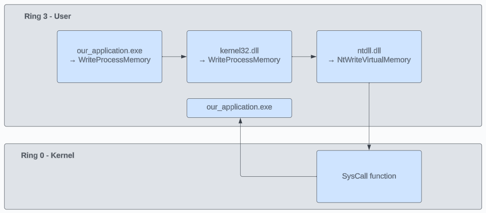

## Bypass AV Hooking with Direct Syscall

### Table of Content
1. [Giới thiệu](#giới-thiệu)
2. [WinAPI Hooking](#winapi-hooking)
3. [Lấy mã máy syscall API](#get-asm-syscall)
3. [Setup VS2022 để code ASM](#setup-vs2022-để-code-asm)
4. [Code](#code)


### Giới thiệu <a name = "giới-thiệu"></a>
Khi viết mã độc trên Windows, điều chúng ta sử dụng các WinAPI là không thể tránh khỏi. Tuy nhiên việc sử dụng các API cần phải thực hiện 1 cách lén lút nếu không sẽ rất
dễ dàng bị các trình AV phát hiện. Một trong những kĩ thuật để phát hiện hành vi của các API mà AV sử dụng đó là Hook API. Bài viết sẽ giải thích cách Hook API hoạt động
và làm sao để bypass việc Hook của AV bằng Direct Syscall.

### WinAPI Hooking
Khi 1 chương trình gọi đến API, nó thực hiện các bước theo sơ đồ dưới đây.


Tuy nhiên, 1 số API sử dụng cơ chế Hook để theo dõi xem API . Cơ chế hook API ở userland mình để link blog của iredteam tại đây: https://www.ired.team/offensive-security/code-injection-process-injection/how-to-hook-windows-api-using-c++.


Để bypass quá trình này, chúng ta có thể sử dụng kĩ thuật unhook dựa vào kĩ thuật hook của iredteam ở trên, hoặc gọi thẳng syscall tại kernelland.

### Lấy mã máy syscall API <a name = "get-asm-syscall"></a>
Để xem mã máy của API, mình mở 1 tiến trình bất kì rồi thực hiện debug tiến trình đấy, mình sẽ thử tìm mã máy của WriteProcessMemory, hay NtWriteVirtualMemory trong ntdll.dll
```
0:031> u NtWriteVirtualMemory
ntdll!NtWriteVirtualMemory:
00007fff`efd8d710 4c8bd1          mov     r10,rcx
00007fff`efd8d713 b83a000000      mov     eax,3Ah
00007fff`efd8d718 f604250803fe7f01 test    byte ptr [SharedUserData+0x308 (00000000`7ffe0308)],1
00007fff`efd8d720 7503            jne     ntdll!NtWriteVirtualMemory+0x15 (00007fff`efd8d725)
00007fff`efd8d722 0f05            syscall
00007fff`efd8d724 c3              ret
00007fff`efd8d725 cd2e            int     2Eh
00007fff`efd8d727 c3              ret
```

Thực tế chúng ta chỉ cần quan tâm đến phần mã sau, đây là phần mã gọi syscall để thực hiện API
```
mov     r10,rcx
mov     eax,3Ah
syscall
ret
```
**Lưu ý:** Tham số đầu vào của hàm sẽ lấy theo tham số của NtWriteVirtualMemory

### Setup VS2022 để code ASM <a name = "setup-vs2022-để-code-asm"></a>
Để có thể biên dịch và chạy mã máy trên VS2022 chúng ta cần setup 1 số thứ như sau: 
</br>
**Chuột phải vào Project -> Build Dependencies -> Build Customizations => Tích vào masm**

Sau đó tạo 1 file .asm để lưu mã syscall, chuột phải vào file, chọn Properties, sửa Item type thành Microsoft Macro Assembler

</br>
### Code
Đây là phần code của file syscall.asm
</br>
**syscall.asm**
```asm
.code
	SysNtWriteVirtualMemory proc
		mov     r10,rcx
		mov     eax,3Ah
		syscall
		ret
	SysNtWriteVirtualMemory endp
end
```

**main.c**
```c
#include <Windows.h>
//Signature of NtWriteVirtualMemory
EXTERN_C NTSTATUS SysNtWriteVirtualMemory(
	HANDLE ProcessHandle,
	PVOID BaseAddress,
	PVOID Buffer,
	ULONG BufferLength,
	PULONG ReturnLength
);

int main() {
	SysNtReadVirtualMemory(ProcessHandle, (PVOID)address2read, &buffer, 8, &byteRead);
	return 0;
}

```
Tham số của hàm trên là giả, nhưng cách sử dụng về cơ bản là như vậy. Sử dụng phương pháp sẽ giúp chúng ta bỏ qua được hook của 1 số AV. Tuy nhiên phương pháp này vẫn có thể bị phát hiện bởi kĩ thuật **Nirvana Debugging** mà mình sẽ nói đến tại phần sau.