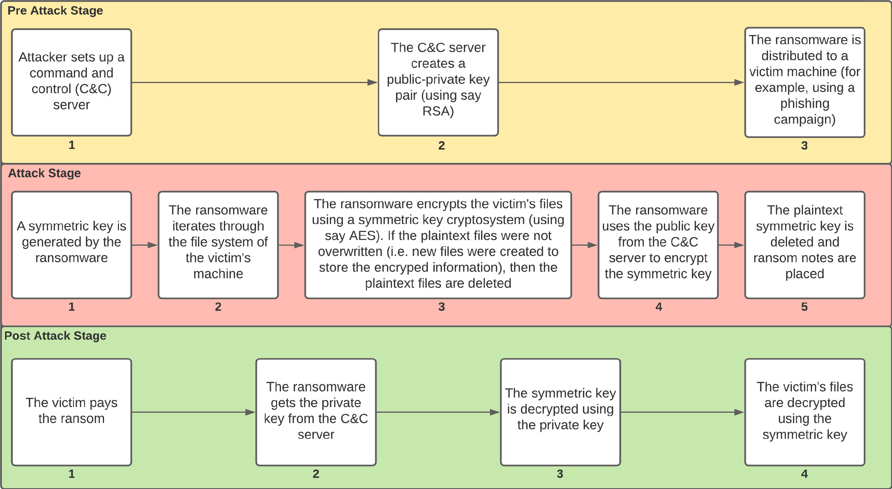

## Ransomeware

### Đặc trưng của ransomware

Ransomeware có 1 số đặc biệt khác biệt so với các loại mã độc khác, được liệt kê dưới đây:

- ***Mục đích:*** Mã hóa dữ liệu và yêu cầu tiền chuộc từ nạn nhân

- ***Phương thức hoạt động:*** Mã hóa dữ liệu và cung cấp khóa giải mã sau khi nhận được tiền chuộc. Trong một số trường hợp, nếu không nhận được tiền chuộc, các nhóm ransomware sẽ công bố dữ liệu.

- ***Phục hồi:*** Phục hồi dữ liệu phụ thuộc vào việc lấy khóa giải mã.

- ***Kĩ thuật***: Ngoài các kĩ thuật giống với các loại mã độc khác, điểm đặc trưng trong mã của ransomware là phần mã mã hóa dữ liệu. Kĩ thuật mã hóa phải mạnh, phức tạp tránh bị phát hiện, ngoài ra việc mã hóa dữ liệu sẽ tiêu tốn CPU nếu sử dụng thuật toán nặng, khiến việc phát hiện dễ dàng hơn.

### Quá trình tấn công của ransomware

Dưới đây là các kĩ thuật sử dụng trong quá trình tấn công mục tiêu linux của AvosLocker:

***Initial Access:*** 

- **Exploit Public-Facing Application:** một phương pháp tấn công mạng phổ biến được sử dụng bởi kẻ tấn công để khai thác lỗ hổng bảo mật trong các ứng dụng có giao diện tiếp xúc với công chúng. Các ứng dụng này bao gồm trang web, cổng thông tin, dịch vụ web, và các hệ thống quản lý nội dung (CMS) có thể truy cập từ Internet. Mục tiêu của kỹ thuật này là để thâm nhập vào hệ thống.

- **Drive-by Compromise:** một kỹ thuật tấn công mạng trong đó kẻ tấn công sử dụng trang web đã bị nhiễm để tự động triển khai mã độc vào máy tính hoặc thiết bị của nạn nhân mà không cần sự tương tác hay sự cho phép của họ. Đây là một trong những phương pháp phổ biến nhất để phát tán malware, bởi vì nó tận dụng lỗ hổng trong các ứng dụng web hoặc trình duyệt web để thực hiện tấn công.

- Trong khi linux thường bị khai thác thì trên windows, hình thức tấn công của ransomware thường là phishing.

***Execution:***

- **Command and Scripting Interpreter:** Kẻ tấn công sẽ tận dụng các trình diễn giải lệnh (như PowerShell trên Windows, bash/sh trên Linux/Unix, hoặc AppleScript trên macOS) để thực thi mã độc hoặc các lệnh độc hại. Việc này sử dụng để tải ransomeware rồi thực thi.

***Credential Access:***

- **Credentials from Password Stores**

***Discovery:***

- **System Information Discovery**

***Collection:***

- **Data from Cloud Storage Object**

***Impact:***

- **Inhibit System Recovery:** Vô hiệu hóa khả năng phục hồi của hệ thống như xóa hoặc mã hóa bản sao lưu.

- **Service Stop**

- **Data Encrypted for Impact:** Mã hóa dữ liệu, được sử dụng bởi ransomware.

### Cách phòng chống 

***Linux:***

- Dựa vào quá trình tấn công, cần phòng chống từ giai đoạn ban đầu, cần thường xuyên cập nhật các phần mềm, hệ điều hành, tránh bị khai thác tấn công `Initial Access`.

- Sao lưu dữ liệu định kì tại vị trí an toàn, tách biệt khỏi mạng chính, để tránh kĩ thuật **Inhibit System Recovery**.

- Áp dụng nguyên tắc quyền truy cập tối thiểu, chỉ cần quyền truy cập cần thiết cho người dùng và ứng dụng. Điều này giảm thiểu rủi ro nếu thông tin đăng nhập bị đánh cắp.

- Sử dụng AV, EDR để kịp phản ứng nếu như bị xâm nhập và mã hóa.

REF: [StopRansomware Guide](https://www.cisa.gov/stopransomware/ransomware-guide)